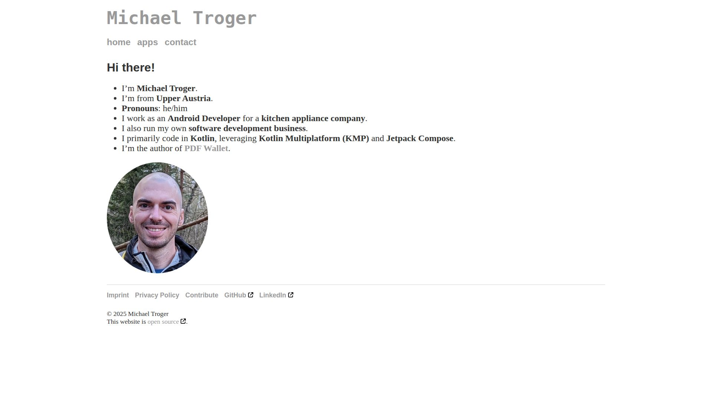

# michaeltroger.com - Personal Website of Michael Troger

This repository is representing the **source code of my private website https://michaeltroger.com** that is hosted with GitHub Pages.
The website is powered by Jekyll and I can use Markdown to author my posts. It is based on [Jonathan McGlone’s](https://github.com/hankquinlan/hankquinlan.github.io/) project.

<table>
<tr>
<td>

</td>
</tr>
</table>

## License
This project on purpose does not provide a license. That means it is **under my exclusive copyright**.
The reason for that being that **99% of this repo is private data** of myself.

Therefore I would recommend to use [Jonathan McGlone’s](https://github.com/hankquinlan/hankquinlan.github.io/) project as a starter, since it doesn't contain any private information and the author allows copying without restrictions.

## Technologies
* Static site generator: Jekyll
* Markdown processor: Kramdown
* Templating language: Liquid
* Style sheets: SCSS
* Scripts: JavaScript

## Instructions
GitHub Pages builds automatically on commits. Files can directly be edited within the GitHub UI.

### Local deployment
1. Move to `docs` folder: `cd docs`
2. Install dependencies: `bundle install`
3. Build and serve the page on [http://localhost:4000](http://localhost:4000): `bundle exec jekyll serve`\
   Optionally call the command [with a GitHub token](https://github.com/jekyll/github-metadata/blob/main/docs/authentication.md), in order to render repository information: `JEKYLL_GITHUB_TOKEN=123abc bundle exec jekyll serve`
